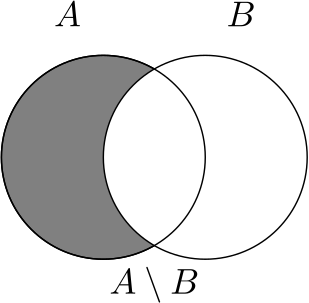

### Exercises
<ol>
<li>
 Let $A = \{-7,2,1\}$ and $B = \{2,6,-7\}$.
<ol type = "a">
<li>Calculate the union between $A$ and $B$ </li>
<li>Calculate the intersection between $A$ and $B$ </li>
</ol>

<button onclick="myFunction('answer1')" class="answerButton">Show Answer</button>

<ol type = "a">
<li>The union between $A$ and $B$ is 
$$A\cup B = \{-7,1,2,6\}$$</li>
<li>The intersection between $A$ and $B$ is 
$$A\cap B = \{-7,2\}$$
</li>
</ol>

 

</li>

<li> 
 Let $A = [-2,1]$ and $B = (0,2)$. 
<ol type = "a">
<li>Calculate the union between $A$ and $B$ </li>
<li>Calculate the intersection between $A$ and $B$ </li>
</ol>

<button onclick="myFunction('answer2')" class="answerButton">Show Answer</button>

<ol type = "a">
<li>The union between $A$ and $B$ is 
$$ A\cup B = [-2,2).$$ </li>
<li>The intersection between $A$ and $B$ is 
$$A\cap B = (0,1].$$ </li>
</ol>

 

 

 
</li>

<li> 
 Let $A = [0,10]$ and $B = (0,2)$.
<ol type = "a">
<li>Calculate the union between $A$ and $B$ </li>
<li>Calculate the intersection between $A$ and $B$ </li>
</ol>

<button onclick="myFunction('answer3')" class="answerButton">Show Answer</button>

<ol type = "a">
<li>The union between $A$ and $B$ is 
$$A\cup B = [0,10].$$ </li>
<li>The intersection between $A$ and $B$ is 
$$A\cap B = (0,2).$$ </li>
</ol>

 

 

 
</li>

<li> 
 Let $A$ and $B$ be sets. Define $C = A\setminus B$ to be the set that contains all elements of $A$ which are not in $B$.
<ol type = "a">
<li>Draw a Venn diagram to schematically represent $C$. </li>
<li> If $A = \{1,2,3\}$ and $B = \{0,1,2\}$, calculate $A\setminus B$. </li>
</ol>

<button onclick="myFunction('answer4')" class="answerButton">Show Answer</button>

<ol type = "a">
<li></li>
<li> $A\setminus B = \{3\}$. </li>
</ol>

 

 

 
</li>

</ol>
