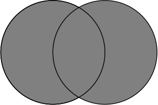
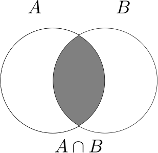

### Introduction
If we want to say that $x$ is a real number, the easiest way to do that is in the language of sets. If we define some structure that contains all real numbers, and say that $x$ is in that structure, then that is the same as saying $x$ is a real number. This is where set theory comes into play. We therefore define a *set* as a collection of objects. If this definition seems unsatisfying to you, then you are not alone; so called *axiomatic set theory* is an entire field of study in which this question is explored in detail. However, we do not concern ourselves with such fundamental mathematics in this course, and this will be our working definition.

In general, we will denote sets by capital letters, $A$, $B$, $C$ etc. If we want to say that $x$ is in the set $A$, we write it as $x\in A$, and read it was "$x$ is an element of $A$". There is a special set $\emptyset$, the *empty set* which contains no elements; the statement $x\in\emptyset$ is always false, no matter what $x$ is. Now I will define a few special sets that we will use continually throughout the course.

### Important Sets of Numbers
We have learned about numbers for many years, and you have slowly been introduced to more and more kinds of numbers. It started with the natural numbers, then you were introduced to the integers, then rational numbers, then finally the real numbers. There are of course more kinds of numbers, but none of them will be explored in this course. 

* We denote the set of all *natural numbers* by  $\N = \\{1,2,3,4,\dots\\}$, and the set of all *nonnegative integers* by $\N_0 = \\{0,1,2,3,4,\dots\\}$. 
* We denote the set of all *integers* by $\Z = \\{\dots,-3,-2,-1,0,1,2,3,\dots\\}$.
* We denote the set of all *rational numbers* by $\Q$, or, the set of all numbers which can be written as the ratio of two integerse, with the denominator being nonzero.
* We denote the set of all *real numbers* by $\R$. This includes all rational and irrational numbers.

### Intervals

There are certain subsets of the real number line which we will use quite frequently. They are the *intervals*. Note that in the following definitions, we require $a < b$.

* The *open interval* from $a$ to $b$ is denoted $(a,b)$ and it consists of all real numbers $x$ such that $a < x < b$
* The *closed interval* from $a$ to $b$ is denoted $[a,b]$ and it consists of all real numbers $x$ such that $a \leq x \leq b$. 
* We denote a *half-open interval* from $a$ to $b$ by either $[a,b)$ or $(a,b]$, which mean all real $x$ such that $a\leq x < b$ or $a < x \leq b$, respectively.

### Operations with Sets

Given two sets, it is possible to combine them in certain ways to make new sets. 

#### Union

Suppose we have two sets $A$ and $B$. The *union* of $A$ and $B$ is denoted by $A\cup B$, and it consists of all elements which are in $A$, in $B$, or in both $A$ and $B$. We can represent this schematically with a Venn diagram, as shown

<figure class="center">

 

<figcaption class="center">Schematic representation of the union between two sets.</figcaption> </figure>

#### Intersection

Suppose we have two sets $A$ and $B$. The *intersection* of $A$ and $B$ is denoted by $A\cap B$, and it consists of all elements which are in both $A$ and $B$. We can represent this schematically with a Venn diagram, as shown

<figure class="center">

 

<figcaption class="center">Schematic representation of the intersection between two sets.</figcaption> </figure>

### Set Building Notation
A useful notation for defining sets is the following. Given a set $A$, we can form the set $S$ by defining $S$ as the set of elements which are in $A$, but satisfy some further property. The notation looks like

$$S = \{x \in A | x\text{ satisfies some property}\}.$$

For example, I could write the set $S = \\{1,2,3\\}$ in this notation in the following way:
$$S = \{x \in \Z | 1\leq x \leq 3\}.$$

### Examples

<b>Example:</b> Let $A = \{1,2,3\}$ and $B = \{3,4,5\}$.
<ol type="a">
<li>Calculate the union of the sets $A$ and $B$. </li>
<li>Calculate the intersection of the sets $A$ and $B$. </li>
</ol>
<b>Solution:</b> 
<ol type = "a">
<li>The union of $A$ and $B$ contains all of the elements which are in $A$, $B$, or both. Thus, the union is
$$A \cup B = \{1,2,3,4,5\}$$ </li>
<li> The intersection of $A$ and $B$ contains all of the elements which are in both $A$ and in $B$. Thus, the intersection is 
$$A\cap B = \{3\}$$</li>
</ol>

 

<b>Example:</b> Let $A$ be the set of all real numbers except $1$. Write $A$ as the union of two intervals.
<b>Solution:</b> We can write this as the union of two open intervals: one going from negative infinity up to but not including 1, and one from 1 but not including 1, up to infinity.
$$A = (-\infty,1)\cup(1,\infty).$$

