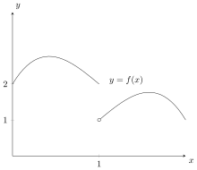

### Introduction

In this section, we will introduce the idea of the limit of a function. This is best done via a picture. Consider the following plot of $y = f(x)$, particularly about the point $x = a$. What happens to the value of $y$ as we approach $x = 1$ from the left? The value of $y$ gets closer and closer to $2$. How about if we approach from the right? Well, the value of $y$ gets closer and closer to 1. At the point $x = 1$, we have $y = 2$. 

<figure class="center">

 

<figcaption class="center">A Classic Example</figcaption> </figure>

To write this mathematically, we would say 

$$\lim_{x\to 1^-} f(x) = 2,\qquad \lim_{x\to 1^+} f(x) = 1.$$

These are read, respectively, as "the limit of $f(x)$ as $x$ approaches 1 from the left is 2" and "the limit of $f(x)$ as $x$ approaches 1 from the right is 1". So, $x\to 1^-$ means $x$ approaches from the left, and $x\to 1^+$ means that $x$ approaches from the right.

DONT' FORGET TO TALK ABOUT ONE SIDED LIMITS
