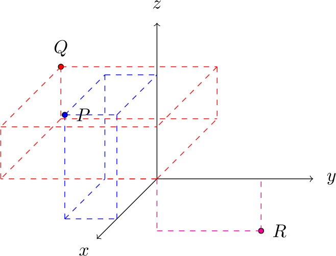

### Exercises
<ol> 
<li>
 Plot the points $P = (2,-1,2)$, $Q = (-3,-3,1)$, and $R = (0,2,-1)$ on a 3D Cartesian coordinate system.

<button onclick="myFunction('answer1')" class="answerButton">Show Answer</button>

To plot these points, we should draw lines from each of the axes to show where the points are. Without these lines, it could be ambiguous where points are. 

<figure class="center">

 
 
</figure>

</li>

</ol>
